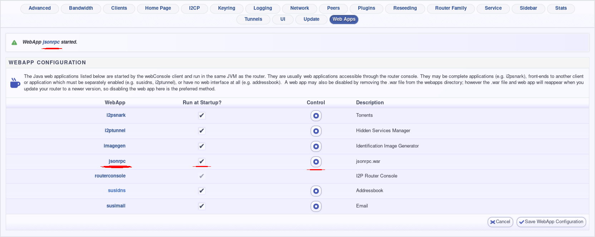

I2P System Tray Control Panel, Cross-Platform
=============================================

This is a very simple system tray application for interacting with I2P. It
can start, stop, or restart an I2P router, or it can launch a browser. It
depends on the presence of an I2P router implementing the i2pcontrol jsonrpc
interface.

To enable jsonrpc on the Java I2P router, go to this the webapps config page:
[http://localhost:7657/configwebapps](http://localhost:7657/configwebapps) and
enable the `jsonrpc` app as seen in the screenshot below:



HELP WANTED!!!
--------------

I don't have a Mac, mine bit the dust. I need help creating a Mac package
of this. Please, if you want a Mac version of this application and have
Mac packaging experience, create an issue so we can work together to figure
out how to support Mac users best.

Until such a time as support is improved, you may be able to install simply
using this curlpipe:

```curl -s https://github.com/eyedeekay/i2p-traymenu/releases/download/v0.1.04/install.sh | sh```
